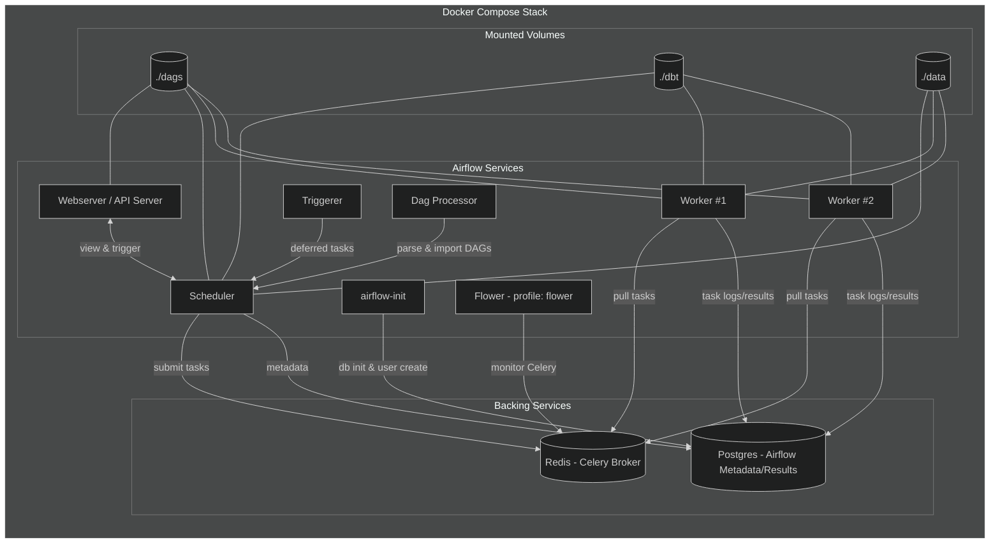
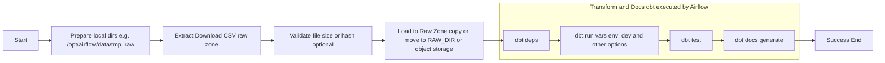

# 🧠 Data Engineer Novice
> **Learning project for practicing data pipeline orchestration and data transformation using Airflow & DBT**

---

## 🎯 Purpose

โปรเจกต์นี้สร้างขึ้นเพื่อฝึกพื้นฐานงาน **Data Engineering** ในสภาพแวดล้อมจริง  
มุ่งเน้นให้เข้าใจภาพรวมของ **ETL/ELT Workflow** — ตั้งแต่การดึงข้อมูล (Extract)  
→ แปลงข้อมูล (Transform) → จัดการงานแบบอัตโนมัติ (Orchestrate) ด้วย  
**Apache Airflow**, **DBT**, **PostgreSQL**, และ **DuckDB**

---

## 🧩 Project Structure

```
data-engineer-novice/
│
├── dags/                  # Airflow DAGs (ETL/ELT workflows)
│   └── assignment.py       # ตัวอย่าง DAG ที่ orchestrate DBT
│
├── dbt/                   # DBT project for SQL transformation & testing
│   ├── models/
│   │   ├── staging/       # ชั้น staging สำหรับ clean / normalize ข้อมูล
│   │   └── marts/         # ชั้น marts สำหรับสร้างตารางเชิงวิเคราะห์
│   └── dbt_project.yml
│
├── Dockerfile.airflow     # Custom Airflow image
├── docker-compose.yml     # Service orchestration
├── requirements.txt       # Python dependencies
├── setup.sh               # Bootstrap setup script
└── README.md
```

---

## ⚙️ Configuration

- Paths and ingestion
  - `AIRFLOW_DATA_DIR` (default: `/opt/airflow/data`)
  - `TMP_DIR` (default: `$AIRFLOW_DATA_DIR/tmp`)
  - `RAW_DIR` (default: `$AIRFLOW_DATA_DIR/raw`)
  - `CSV_NAME` (default: `cdc_data.csv`)
  - `CSV_URL` (default: CDC CSV download URL)
- HTTP downloading
  - `HTTP_TIMEOUT_CONNECT` (default: `5` seconds)
  - `HTTP_TIMEOUT_READ` (default: `30` seconds)
  - `HTTP_CHUNK_SIZE` (default: `16384`)
- dbt CLI locations
  - `DBT_PROJECT_DIR` (default: `/opt/airflow/dbt`)
  - `DBT_PROFILES_DIR` (default: `/opt/airflow/dbt/profiles`)
  - `DBT_DOCS_PORT` (default: `8082`)
- dbt project/profile settings
  - `DBT_PROFILE_NAME` (default: `data_eng_assignment`)
  - `DBT_TARGET` (default: `dev`) → matches a profile output
  - `DBT_SCHEMA` (default: `analytics`)
  - `DBT_DUCKDB_PATH` (default: `/opt/airflow/dbt/warehouse.duckdb`)
  - `DBT_THREADS` (default: `4`)
  - `CSV_URI` (optional) → default for `vars.csv_uri` in dbt_project.yml; the DAG passes the file path dynamically at runtime

All of these are read dynamically by the DAG (`dags/config.py`) and dbt templated configs (`dbt/dbt_project.yml`, `dbt/profiles/profiles.yml`). You can override them via environment (e.g., in `docker-compose.yaml` or your shell) without code changes.

---

## ⚙️ Tech Stack Overview

| Layer | Tool | Purpose |
|:------|:-----|:---------|
| **Orchestration** | Apache Airflow 3.x | Schedule & manage data pipelines |
| **Transformation** | DBT Core | SQL modeling, testing, and documentation |
| **Storage** | PostgreSQL (Airflow metadata) / DuckDB | Metadata DB & analytics warehouse |
| **Compute** | Docker Compose | Local orchestration and isolation |
| **Monitoring** | Flower | Celery task monitoring dashboard |

---

## 🚀 Quick Start

### 1️⃣ Clone & Setup
```bash
git clone https://github.com/lu69x/data-engineer-novice.git
cd data-engineer-novice
bash setup.sh
```

> `setup.sh` จะสร้าง volume, เตรียม environment, และตั้งค่า Airflow เบื้องต้นให้พร้อมใช้งาน

---

### 2️⃣ Start Stack (with Flower profile)

รัน Airflow พร้อม Flower Dashboard สำหรับดูสถานะ Celery workers:

```bash
docker compose --profile flower up -d
```

| Service | URL |
|----------|-----|
| 🌐 Airflow Web UI | [http://localhost:8080](http://localhost:8080) |
| 🌼 Flower Dashboard | [http://localhost:5555](http://localhost:5555) |
| 🐘 PostgreSQL | localhost:5432 |

---

### 3️⃣ Run DBT (via Airflow DAG) -- Optional

> ⚠️ **สำคัญ:**  
> DBT จะถูกรันโดยอัตโนมัติผ่าน Airflow DAG เท่านั้น  
> หากรัน DBT เอง (`dbt run` / `dbt docs generate`) ต้องระวัง:
> - ต้องส่งค่า `--vars` ให้ครบ  
> - ต้องมีค่า default ใน `profiles.yml` มิฉะนั้น `dbt docs` จะไม่ถูกสร้าง

ตัวอย่าง (สำหรับ debug เท่านั้น):

```bash
docker compose exec airflow-scheduler bash
cd /opt/airflow/dbt
dbt run --vars '{"env": "dev"}'
dbt test
dbt docs generate
```

---

## 🧮 Learning Goals

- เข้าใจ **ETL/ELT workflow** ตั้งแต่ raw → staging → marts  
- ฝึกใช้ **Airflow DAGs** เพื่อ orchestrate งานข้อมูล  
- เรียนรู้การสร้าง **DBT models**, **tests**, และ **documentation**  
- ใช้ **Docker Compose profiles** เพื่อเปิด/ปิดบริการเสริมอย่าง Flower  
- วิเคราะห์ log และแก้ปัญหา pipeline ด้วย Airflow UI และ Flower

---

## 🧱 System Architecture (Docker Compose View)



---

## 🔁 DAG Runtime Flow (`assignment.py`)



---

## 🧠 SQL Models Explained
# สรุปชั้นของโมเดล dbt

| ชั้น (Layer) | โมเดล | วัตถุประสงค์หลัก | แหล่งข้อมูล/การพึ่งพา | ผลลัพธ์สำคัญ |
| --- | --- | --- | --- | --- |
| Staging | `stg_cdi_raw` | อ่านข้อมูลดิบจากไฟล์ CSV ที่กำหนดผ่านตัวแปรโครงการ | `var('csv_uri')` → `read_csv_auto` | ตารางดิบทุกคอลัมน์จากไฟล์ต้นฉบับ เพื่อใช้เป็นฐานสำหรับการทำความสะอาด | 
| Staging | `stg_cdi_clean` | ทำความสะอาดและปรับรูปแบบข้อมูล เช่น แปลงค่าที่เป็นสตริงให้เป็นตัวเลข, ดึงปี, สถานที่, เมทาดาต้า และค่าสถิติต่าง ๆ | อ้างอิง `stg_cdi_raw` | ตารางสะอาดพร้อมคอลัมน์ปี สถานที่ เมทาดาต้า ค่าตัวเลขที่ normalize แล้ว ค่าความเชื่อมั่น พิกัด และข้อมูล stratification | 
| Staging | `stg_cdi_normalized` | เลือกเฉพาะฟิลด์ที่ผ่านการ normalize แล้วเพื่อเตรียมใช้ในมิติและมาร์ต | อ้างอิง `stg_cdi_clean` | ตารางคอลัมน์ที่พร้อมเชื่อมกับมิติต่าง ๆ เช่น location/question/response/value type และ stratification | 
| Dimensions | `dim_topic` | สร้างตารางมิติเพื่อจัดกลุ่มคำถามตามหัวข้อ | `stg_cdi_clean` | รายการ `topic_id`–`topic` ที่ไม่ซ้ำ | 
| Dimensions | `dim_question` | สร้างตารางมิติคำถามเพื่อใช้เชื่อมกับแฟกต์ | `stg_cdi_clean` | รายการ `question_id`–`question` พร้อม `topic_id` | 
| Dimensions | `dim_response` | รวบรวมคำตอบที่เป็นไปได้สำหรับคำถาม | `stg_cdi_clean` | รายการ `response_id`–`response` ที่ไม่ซ้ำ | 
| Dimensions | `dim_location` | จัดเตรียมข้อมูลมิติพื้นที่พร้อม lat/lon | `stg_cdi_clean` | `location_id`, ตัวย่อ, ชื่อเต็ม, พิกัด | 
| Dimensions | `dim_value_type` | จัดเก็บเมทาดาต้าเกี่ยวกับชนิดค่าและหน่วย | `stg_cdi_clean` | รายการ `value_type_id`–`value_type`–`unit` | 
| Dimensions | `dim_strat_category` | รวมหมวดหมู่การแบ่งกลุ่ม (stratification categories) ทุกลำดับ | `stg_cdi_clean` | รายการ `strat_cat_id`–`strat_cat` ที่ไม่ซ้ำ | 
| Dimensions | `dim_strat_value` | รวมค่าการแบ่งกลุ่ม (stratification values) ทุกลำดับ | `stg_cdi_clean` | รายการ `strat_cat_id`–`strat_id`–`strat` ที่ไม่ซ้ำ | 
| Marts | `agg_norm_question` | สร้างตารางแฟกต์ที่เชื่อมข้อมูล normalized กับมิติคำถาม/หัวข้อ เพื่อการวิเคราะห์ตามคำถาม | `stg_cdi_normalized`, `dim_question`, `dim_topic` | ผลลัพธ์ประกอบด้วยปี ค่าที่ normalize แล้ว ช่วงความเชื่อมั่น และรายละเอียดคำถาม/หัวข้อ | 
| Marts | `agg_norm_location` | สร้างตารางแฟกต์ที่ผูกข้อมูล normalized กับมิติพื้นที่ | `stg_cdi_normalized`, `dim_location` | แฟกต์ที่รวมข้อมูล normalized พร้อมรายละเอียดพื้นที่ | 

---

## ⚠️ DBT Tips & Caveats

- กำหนดค่า `vars` และ `profiles.yml` ให้ครบ  
- หากไม่มี default `target` หรือ `vars` → DAG อาจ success แต่ `dbt docs` ไม่ถูกสร้าง  
- ตรวจสอบ volume mapping (`./dbt`, `./data`) ให้ scheduler และ worker เห็นเหมือนกัน  
- ใช้ `dbt test` สำหรับตรวจสอบ constraint เช่น  
  ```yaml
  tests:
    - not_null
    - unique
    - relationships:
        to: ref('dim_customer')
        field: customer_id
  ```

---

## 📄 License
MIT License — Free for personal and educational use
